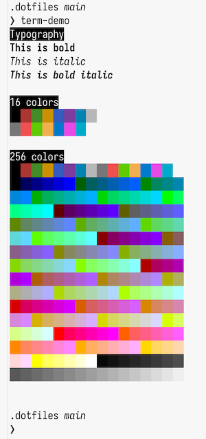

# dotfiles

My dotfiles. I don't recommend running these as your own. I'm sharing them so you can steal things for your own dotfiles.



## Install

Clone onto your laptop:

```sh
git clone https://github.com/klaaspieter/dotfiles.git
```

Install and configure the following:

- [rcm]
- [GitHub CLI]
- [1Password CLI]
- [neovim]
- [starship prompt]
- [ghostty]
- [zoxide]
- [mise]

### macOS

[Install Homebrew][Install Homebrew].

Make the 1Password SSH agent path consistent with Linux:

```sh
mkdir -p ~/.1password
ln -s ~/Library/Group\ Containers/2BUA8C4S2C.com.1password/t/agent.sock ~/.1password/agent.sock
```

### Linux

Make zsh the default shell:

```sh
apt-get install zsh # if necessary
chsh
```

Install spaceship prompt:

```sh
git clone --depth=1 https://github.com/spaceship-prompt/spaceship-prompt.git $HOME/.local/state/zsh/spaceship
```

Apt has a very old version of NeoVim. Install NeoVim 0.8.0 or later:

```sh
sudo add-apt-repository ppa:neovim-ppa/unstable
sudo apt-get update
sudo apt-get install neovim
```

### Install dotfiles

With all the prerequisites out of the way; install the actual dotfiles using [rcm]:

```sh
rcup
```

## Attribution

Many scripts and configurations have been inspired by [thoughtbot]'s [laptop script][thoughtbot laptop repo] and [dotfiles][thoughtbot dotfiles repo]. I've also stolen many things from [Gordon Fontenot][Gordon's dotfiles].

[Install Homebrew]: https://docs.brew.sh/Installation
[GitHub CLI]: https://cli.github.com
[1Password CLI]: https://developer.1password.com/docs/cli
[starship prompt]: https://starship.rs/guide/#%F0%9F%9A%80-installation
[ghostty]: https://ghostty.org/docs/install/binary#macos
[mise]: https://mise.jdx.dev/installing-mise.html
[zoxide]: https://crates.io/crates/zoxide#installation
[neovim]: https://github.com/neovim/neovim/blob/master/INSTALL.md#homebrew-on-macos-or-linux
[thoughtbot]: https://thoughtbot.com
[thoughtbot laptop repo]: https://github.com/thoughtbot/laptop
[thoughtbot dotfiles repo]: https://github.com/thoughtbot/dotfiles
[Gordon's dotfiles]: https://github.com/gfontenot/dotfiles
[rcm]: https://github.com/thoughtbot/rcm
